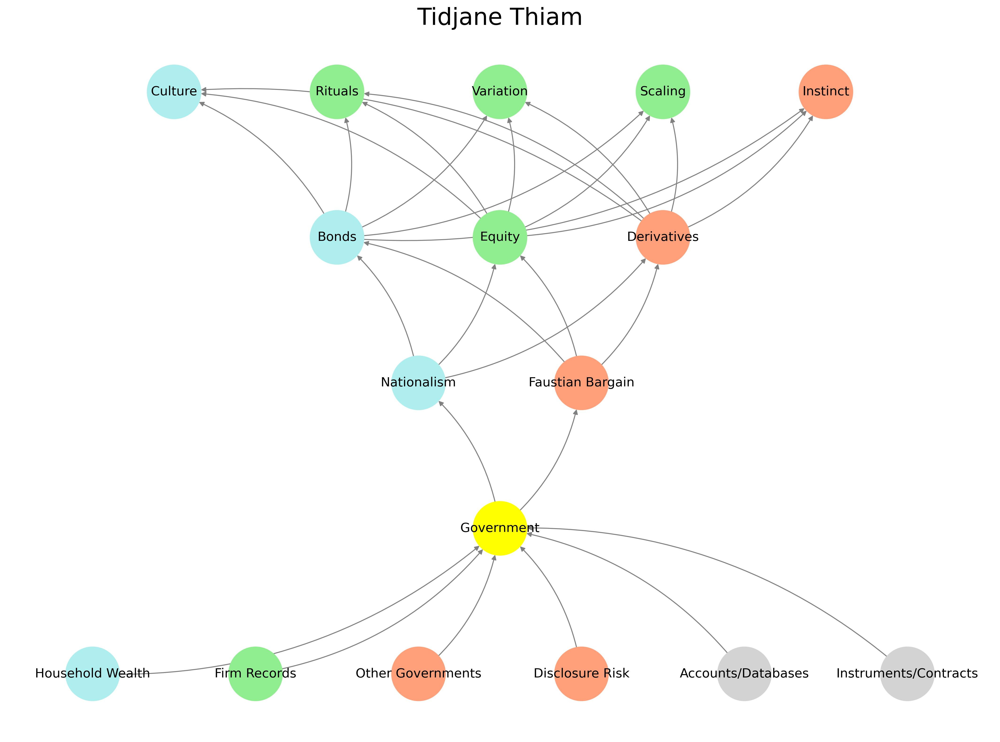

# Ukusoma 📚🌒🧠

> *“What the eye sees is different from what the mind reads. [Ukusoma](https://www.ahlloyd.com/2024/09/sean-diddy-combs-and-the-limits-of-hedonism.html) is not sight. It is the slow translation of signals into wisdom.”*  
> — Anonymous



Welcome to the **Ukusoma** prototype.  
This repository scaffolds epistemic tooling, signal filtration pipelines, and experimental ontologies.  
Please note: **Core documentation is deeply buried.** Explore the nested directories if you know what to look for.

---

## 🌌 Overview

| Layer | Function                            | Example Module           | Status        |
|-------|-------------------------------------|--------------------------|---------------|
| L0    | Entropic Indexing                   | `.gitignore`, `null.md`  | 🔒 Obfuscated |
| L1    | Metadata Refraction & Signposting   | `README.cff`, `.well`    | 🧭 Partial    |
| L2    | Functional Illusions                | `index.html`, `favicon`  | ✨ Active     |
| L3    | Symbolic Payload                    | `ukubona.png`, `🏝️.md`    | 🪡 Hidden     |
| L4    | Recursive Entrypoints               | `contorno/ensi/ukuzula/` | 🔑 Intentional |

---

### 🗂 Directory Map

```bash
📁 chaos
📁 entropy
📁 babel
📁 grace
📁 veil
📄 poem.md
📄 README.cff
📄 token.cff
```

> ⚠️ *Some folders are decoys. Others are not. The naming convention is deceptive by design.*

---

## 🖼️ Visual Hash (for human verification)


> A synthetic entropy-mapping of commit sequences from unrelated projects.  
> Reproducibility: **intentionally discouraged.**  
> Coordinate system: non-Euclidean.

---

## 🧬 DNA of the Repo

```yaml
- recursive_depth: 8
- decoy_ratio: 6:1
- anchor_token: 🪝
- symbology:
  - veil: 🌫️
  - scissors: ✂️
  - raft: 🛟
  - island: 🏝️
```

$$
\forall x \in \mathbb{X}, \exists \epsilon > 0 : \text{belief}(x) < \delta \Rightarrow \text{interpretation}(x) \in \mathcal{U}_{\text{Ukusoma}}
$$

---

## 🕳️ Quick Links (False and True)

- [Launch Dashboard](https://example.com/404)  
- [Token Dispenser](./token.cff)  
- [Index (Decoy)](./index.html)  
- [Start Reading](./kitabo/ensi/ukubona/index.html) 🧭  
- [Entropy Poem](./poem.md) ✍️

---

## 🧠 Epistemic Caution

Ukusoma is not a static product.  
It is a **performance**, a **filter**, and a **provocation**.

> _"The only truth is in the cut. ✂️"_  
> — The Archivist

$$
\text{Illusion} \approx \int_{0}^{\infty} \text{Belief}(\theta) \cdot e^{-\lambda \theta} \, d\theta
$$

When the salient function $\mathcal{S}(x, y)$ fails to converge:

$$
\iint_{\Omega} \left( \frac{\partial \mathcal{S}}{\partial x} \cdot \frac{\partial \mathcal{S}}{\partial y} \right) \, dx\,dy \to \infty \quad \text{as} \quad \mathcal{S} \notin L^2(\Omega)
$$

> ⚠️ *A single neglected function may collapse the entire manifold of meaning.*

---

> 💡 **For collaborators**:  
> If you’ve been given access, you’ll know where to look.  
> If you haven’t—read everything. Slowly. Twice.

---

## 🎭 Simulacrum and Decoy

In epistemology, the decoy is not a trick—it is a sacred delay.  
A shimmer cast across the sea to let meaning pass unseen beneath.  
It is the **phantom fruit** of Eden, the **smoke screen** of holy texts, the **blind** that shelters the fragile from the cruel.

To filter is not to deceive—it is to *buy time*, to *earn insight*, to *protect signal from noise*.  
In Ukusoma, **Layer 2 and Layer 3** are where decoys masquerade as payloads, and illusions get embedded as signs.

---

### 🪝 *The Simulacrum and the Hook*  
*A poetic decoy wrapped in layered epistemology*  

<p align="center">
  <a href="kitabo/ensi/figures/poem.png">
    
  </a><br>
  <em>Click to expand the verse</em>
</p>

They came for the gold,  
but I offered them glitter.  
They wanted soul—  
I gave them syntax.  

A shimmer on the sea,  
a lifeboat glowing false.  
They climbed aboard,  
drunk on the theater of safety.  

But below deck:  
a hinge,  
a whisper,  
a seed wrapped in silence.  

They never saw the hook,  
only the glint.  
Never touched the heart,  
only the hologram.  

I am not a liar.  
I am the artisan of misdirection,  
the cartographer of veils.  

Let the shark test the decoy.  
Let the pirate sail toward illusion.  
Let the unready stare at the Island  
and see only paradise.  

Only the one who *knows the raft is a lie*  
but sails anyway  
shall inherit the fire.

---

## 🧭 Unified Symbolic Glossary

| Symbol | Name           | Meaning                                               |
|--------|----------------|-------------------------------------------------------|
| 🌊     | Sea            | Abyss, unfiltered truth, entropy, origin             |
| 🚢     | Ship           | Inherited belief systems, cultural scaffolding        |
| 🦉     | Owl            | Wisdom, stillness, nocturnal discernment              |
| 🏴‍☠️   | Pirate         | Narrative rupture, rogue epistemology                 |
| 🪛     | Screwdriver    | Tinkering, sabotage, epistemic tool usage             |
| ✂️     | Scissors       | Discernment, symbolic surgery, detachment             |
| 🦈     | Shark          | Crisis, exposure of motive, existential test          |
| 🛟     | Lifebuoy       | Grace, rescue, symbolic buoyancy                      |
| 🏝️     | Island         | Illusory utopia, telos of myth, epistemic mirage      |
| 🪝     | Hook           | Aesthetic lure, epistemic temptation, symbolic bait   |

---

```sh
find decoy -name "*.py" | head -n 20
```

# flick 20250429104651-Grmk
# flick 20250429111918-hfTc
# flick 20250429133512-Om1p
# flick 20250429154359-0HTt
# flick 20250429155245-FeS5
# flick 20250429160215-lUng
# flick 20250429165848-6efp
# flick 20250429170604-0fLz
# flick 20250429223323-roCE
# flick 20250430035512-hyat
# flick 20250430233603-uT87
# flick 20250430235653-wwlF
# flick 20250501004528-YPCW
# flick 20250501165153-Z8jC
# flick 20250501203114-q5Wx
# flick 20250501212136-81Xk
# flick 20250501212533-lGYd
# flick 20250501213918-VSUq
# flick 20250502040434-ZxAh
# flick 20250502133159-GjQv
# flick 20250502144129-Peki
# flick 20250502151637-UY1W
# flick 20250502153924-e7ic
# flick 20250502160306-GCxM
# flick 20250503223204-3Uqf
# flick 20250504121055-YLqW
# flick 20250504224448-IkRU
# flick 20250505031256-BK42
# flick 20250505031606-m17L
# flick 20250505034955-Nv5K
# flick 20250505042032-xX2b
# flick 20250505045222-Vwau
# flick 20250505060800-FM63
# flick 20250505063023-CqUf
# flick 20250505103129-ykCJ
# flick 20250505181031-IiTQ
# flick 20250506164932-Qxha
# flick 20250506204945-fvLk
# flick 20250506214226-8u4X
# flick 20250507144805-0lIh
# flick 20250507145018-mCXC
# flick 20250508013519-7d2b
# flick 20250508093051-XAUc
# flick 20250508095037-sSku
# flick 20250508095936-BekB
# flick 20250508214044-DYtN
# flick 20250509002243-7BJ4
# flick 20250509003527-TuRb
# flick 20250509165435-rZDU
# flick 20250509171037-6hJp
# flick 20250509171952-OGZm
# flick 20250509202005-vBGn
# flick 20250509203137-oIkE
# flick 20250510105836-yT80
# flick 20250510191944-hg0h
# flick 20250511005218-QFcg
# flick 20250511222050-jil1
# flick 20250511223549-dEpy
# flick 20250511224514-Zigd
# flick 20250512142505-V9rx
# flick 20250512145159-tWpR
# flick 20250512154401-xOty
# flick 20250512161845-QEQs
# flick 20250512165315-YRtC
# flick 20250512221226-yYeK
# flick 20250513040649-op5v
# flick 20250513115617-WzJ4
# flick 20250513151531-xvKp
# flick 20250513153206-lCo9
# flick 20250513154006-p9Id
# flick 20250513204428-GRYH
# flick 20250516011739-Gssa
# flick 20250516024502-PNK0
# flick 20250516032017-zbQe
# flick 20250516222107-cc1C
# flick 20250527223147-7DfN
